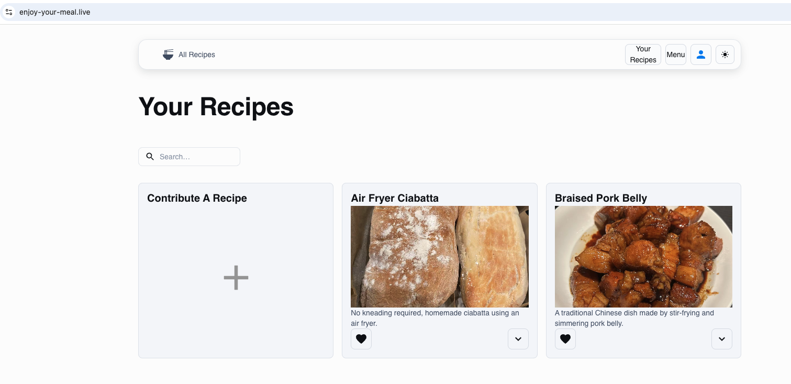

# Enjoy Your Meal - Backend

Welcome to the **Enjoy Your Meal** backend, an Express.js API that supports a recipe-sharing website where users can contribute, favorite, and manage their recipes.

## 🚀 Project Overview
**Enjoy Your Meal** is a recipe website designed to allow users to:
- Share their favorite recipes.
- Organize recipes into menus.
- Favorite recipes for quick access.

Frontend repository link: [enjoy-your-meal](https://github.com/KaiLi0822/enjoy-your-meal)

## 🌟 Features
- **User Authentication:** Secure login, logout, and token refresh with JWT.
- **Recipe Management:** Add and favorite recipes.
- **Menu Organization:** Group recipes into menus.
- **(Coming Soon) Search Functionality:** Quickly search through recipes.

### 📸 Screenshots


## 📦 Project Structure
```
├── controllers
├── middlewares
├── models
├── routes
├── types
├── utils
├── app.ts
└── server.ts
```

## ⚙️ Installation & Setup
1. **Clone the repository:**
   ```bash
   git clone <repository-link>
   cd enjoy-your-meal-backend
   ```
2. **Install dependencies:**
   ```bash
   npm install
   ```
3. **Configure Environment Variables:**
   Set up `.env` with:
   ```env
   JWT_SECRET=your_jwt_secret
   TABLE=your_dynamoDB_table
   BUCKET=your_s3_bucket_name
   ```
4. **Run the server:**
   ```bash
   npm run start:dev
   ```

## 🔒 Authentication
The app uses JWT for secure authentication:
- **Login:** Generates access and refresh tokens.
- **Refresh Token:** Extends session without re-login.
- **Logout:** Clears refresh tokens.

Sample code snippet:
```typescript
const accessToken = jwt.sign(
  { email: user.email },
  config.jwtSecret,
  { expiresIn: config.accessTokenExpiresIn }
);
```

## 🗂️ Tech Stack
- **Backend:** Node.js, Express.js, TypeScript
- **Database:** AWS DynamoDB
- **Storage:** AWS S3
- **Authentication:** JWT
- **Secret:** AWS Secret Management


## 📬 Contact
For any queries, feel free to reach out at *(18840864172@163.como)*.

Enjoy sharing your favorite meals! 🍽️
